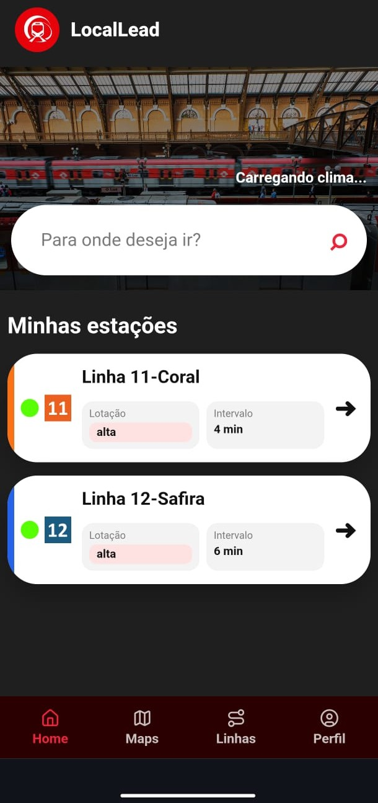
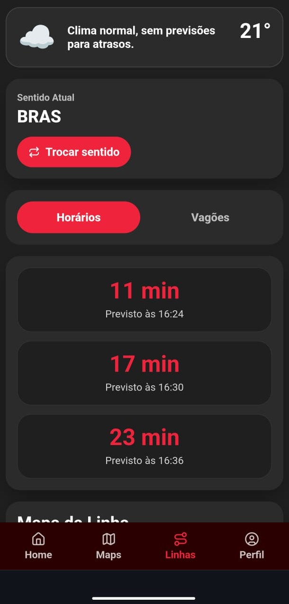
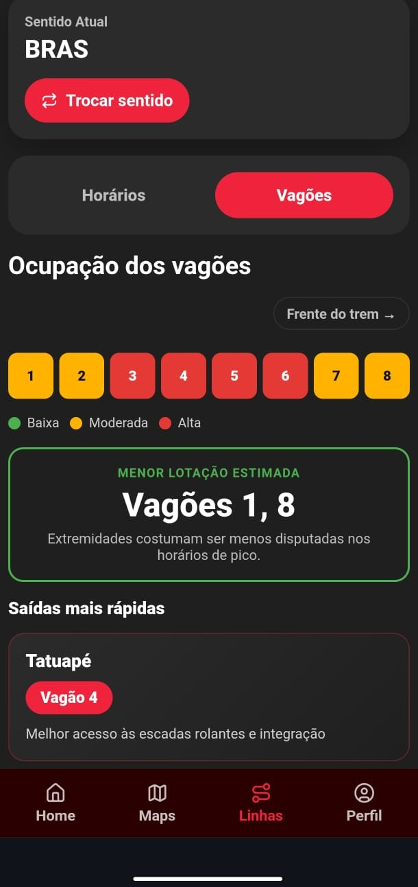
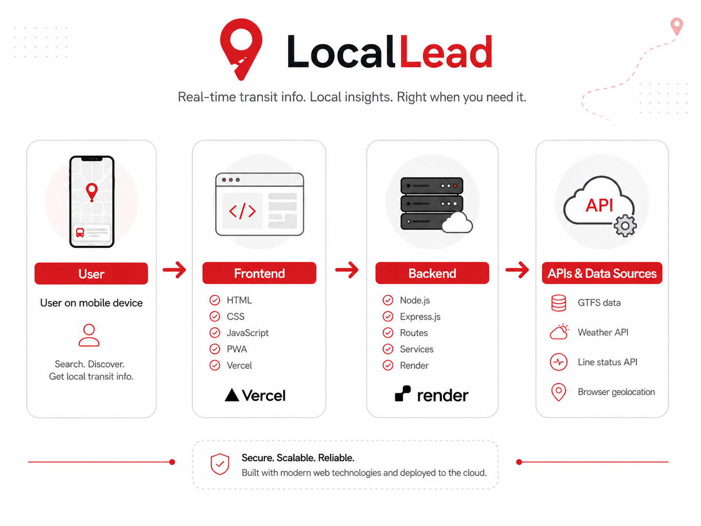
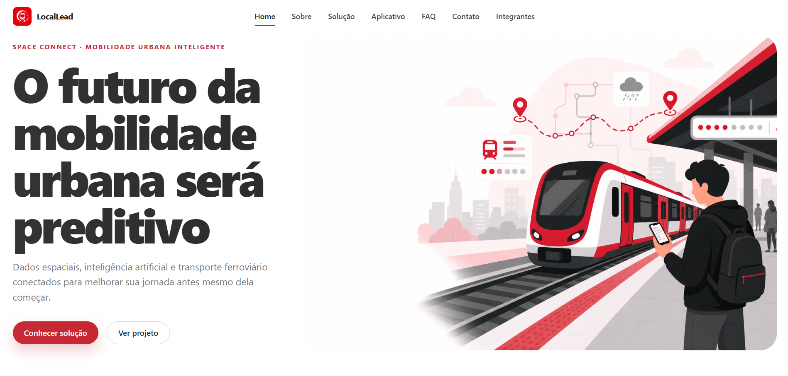
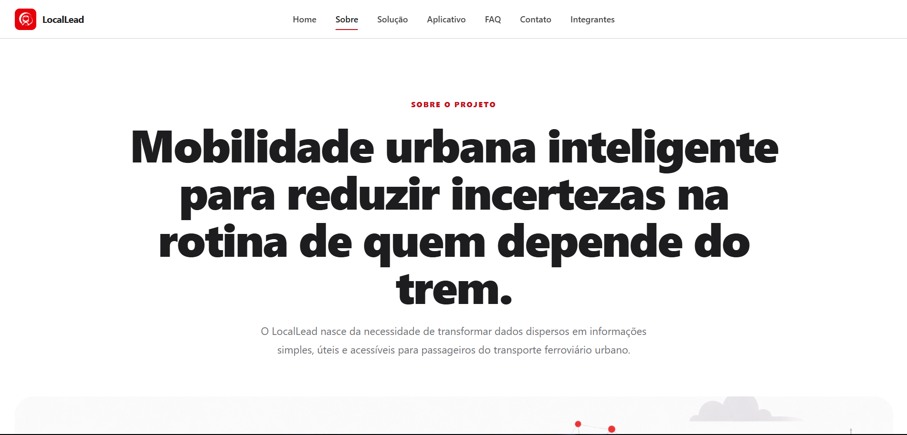
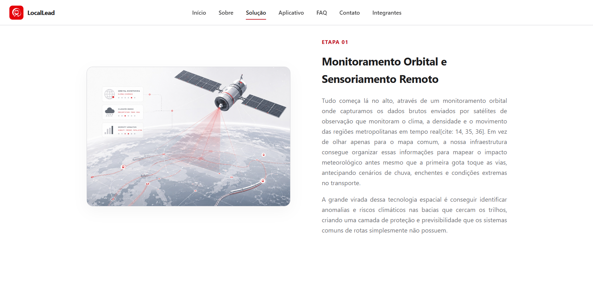
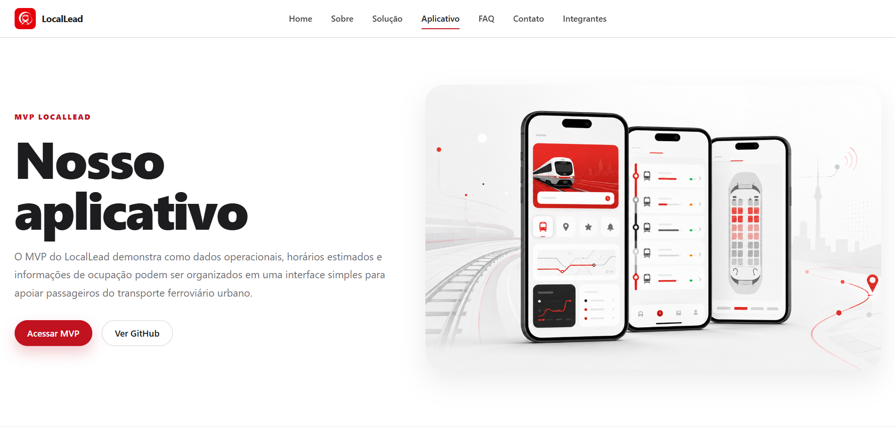
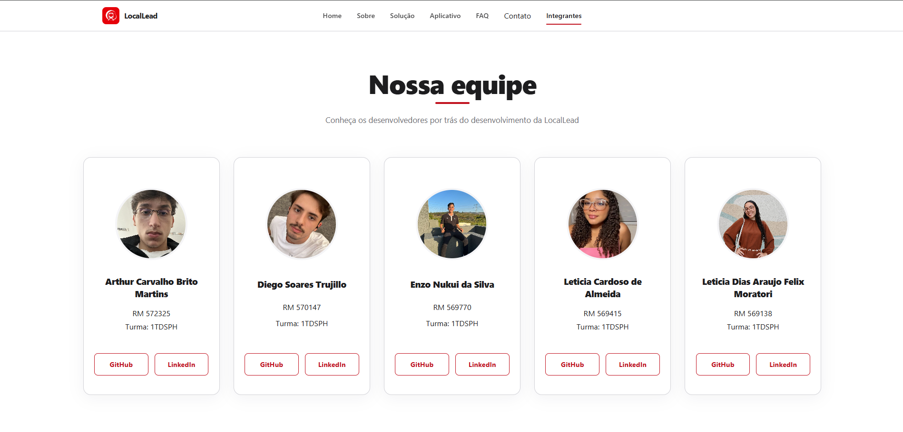

# LocalLead 🚆

<p align="center"><strong>Informação para decidir melhor antes de embarcar.</strong><br>
Um MVP de mobilidade ferroviária que reúne status das linhas, estação próxima, previsões de chegada, clima e ocupação estimada dos vagões.</p>

<p align="center">
  <a href="https://locallead.vercel.app/"><strong>📱 Experimentar o MVP</strong></a> &nbsp;·&nbsp;
  <a href="https://locallead-site.vercel.app/index.html"><strong>🌐 Conhecer o projeto</strong></a> &nbsp;·&nbsp;
  <a href="https://locallead-api.onrender.com/"><strong>🔌 Acessar a API</strong></a>
</p>

<p align="center">&nbsp;&nbsp;&nbsp;&nbsp;</p>
<p align="center"><sub>Escolha a linha → consulte os próximos trens → compare os vagões. Capturas ilustrativas do MVP.</sub></p>

> **Global Solution FIAP 2026** · Projeto acadêmico · Cobertura inicial: **Linhas 11-Coral e 12-Safira da CPTM**

## Uma prévia do aplicativo

O MVP foi desenhado para uma leitura rápida no celular: a pessoa escolhe uma linha, entende o cenário e chega à informação que precisa sem atravessar telas desnecessárias.

<p align="center">
  
  
</p>
<p align="center"><sub>As duas linhas disponíveis no MVP, cada uma com sua identidade visual.</sub></p>

## Navegue pelo projeto

| Quero… | Acesse |
| --- | --- |
| Testar a experiência no celular | [MVP publicado na Vercel](https://locallead.vercel.app/) |
| Entender a proposta e conhecer a equipe | [Site institucional publicado](https://locallead-site.vercel.app/index.html) |
| Ver o código do aplicativo | [Front-end do MVP](mvp_locallead/front-end/) e [API do MVP](mvp_locallead/back-end/) |
| Explorar o site institucional | [Código do site](site-institucional/) |
| Consultar a documentação detalhada | [README do MVP](mvp_locallead/readme.md) e [README do site](site-institucional/readme.md) |
| Relatar um problema ou sugerir uma melhoria | [Issues do repositório](https://github.com/EnzoNukui/LocalLead/issues) |

## Por que o LocalLead existe?

Na rotina de quem usa o trem, poucos minutos mudam a decisão de sair, esperar, trocar de sentido ou escolher onde embarcar. Essas informações costumam estar dispersas. O **LocalLead** propõe reunir o que é útil para a viagem em uma interface direta, feita primeiro para o celular.

Este repositório reúne **duas entregas complementares**. O **MVP** demonstra a experiência prática do passageiro; o **site institucional** apresenta o problema, a visão da solução, o aplicativo e a equipe. A proposta conceitual do site explora o uso de dados espaciais, clima e inteligência para uma mobilidade mais previsível. O MVP implementa uma primeira versão com dados disponíveis e regras de estimativa, descritas abaixo.

## O MVP: da escolha da linha ao embarque

### 1. Veja a situação das linhas

A tela inicial destaca as Linhas **11-Coral** e **12-Safira**, com situação operacional, intervalo e lotação geral estimada. O status é consultado por uma integração externa; a API do projeto mantém um cache de cinco minutos para essa consulta.

### 2. Encontre sua estação e consulte os próximos trens

Com a permissão do usuário, a **Geolocation API** do navegador fornece a posição para identificar a estação mais próxima da linha selecionada. Na tela da linha, é possível alternar o sentido e consultar os próximos trens estimados, além de percorrer um mapa linear das estações.

<p align="center"></p>

As previsões combinam estação, sentido, horário, intervalos operacionais, arquivos **GTFS** e tabelas internas de fim de semana. São **estimativas**, não posições recebidas diretamente dos trens.

### 3. Compare os vagões

O MVP apresenta uma estimativa visual de ocupação por vagão e sugere opções de embarque conforme o nível geral de lotação. Em algumas estações principais, também exibe sugestões de acesso para o desembarque.

<p align="center"></p>

As cores e sugestões resultam de **regras internas**. Não há sensores medindo a ocupação real da composição.

### 4. Considere o clima e instale no celular

A aplicação consulta informações meteorológicas para exibir uma mensagem contextual ao passageiro. Como **PWA**, possui manifesto e service worker e pode ser adicionada à tela inicial em navegadores compatíveis. A localização precisa ser autorizada para a função de estação próxima.

## Como as peças se conectam

<p align="center"></p>
<p align="center"><sub>Fluxo da solução: o navegador conversa com o front-end, que consulta a API e suas fontes de dados.</sub></p>

```text
Passageiro no navegador
        │ localização autorizada + linha e sentido escolhidos
        ▼
Front-end do MVP (HTML, CSS, JavaScript, PWA)
        │ requisições HTTP
        ▼
API LocalLead (Node.js + Express)
        ├── status operacional → serviço externo
        ├── clima → serviço externo
        ├── estação próxima → coordenadas das estações
        ├── próximos trens → GTFS + intervalos + regras
        └── lotação e vagões → estimativas por horário e regras
```

O front-end do MVP foi preparado para publicação na **Vercel** e a API para o **Render**. Os links de demonstração estão no início deste README. O site institucional é uma aplicação estática independente da API.

### Endpoints da API

| Rota | Finalidade | Parâmetros |
| --- | --- | --- |
| `GET /status` | Situação operacional das linhas | — |
| `GET /clima` | Clima e mensagem contextual | `lat`, `lon` |
| `GET /estacao-proxima` | Estação mais próxima | `linha`, `lat`, `lon` |
| `GET /proximos-trens` | Próximas chegadas estimadas | `linha`, `estacao`, `destino` |
| `GET /mapa-linha` | Estações ordenadas por sentido | `linha`, `destino` |
| `GET /lotacao` | Lotação geral estimada | `linha` |
| `GET /vagoes` | Ocupação e sugestões por vagão | `linha`, `destino` |

Por exemplo, com a API local em execução, `http://localhost:3000/lotacao?linha=12` consulta a lotação estimada da Linha 12. As rotas que usam serviços externos dependem da disponibilidade dessas fontes.

## O site institucional

O site conta a história do projeto: o desafio de viajar com pouca previsibilidade, a proposta de solução, a apresentação do aplicativo e os integrantes. Foi construído com **HTML, CSS e JavaScript**, com páginas e estilos responsivos.

| Página inicial | Sobre o projeto |
| :---: | :---: |
|  |  |

| Visão da solução | Apresentação do aplicativo |
| :---: | :---: |
|  |  |

<p align="center"><strong>Equipe</strong></p>
<p align="center"></p>

## Execute na sua máquina

**Pré-requisitos:** Git, navegador moderno, **Node.js e npm** para a API, além de um servidor HTTP estático para as páginas. O **Live Server** no VS Code é uma opção simples. Use `localhost` para testar localização e recursos do PWA.

### 1. Clone o repositório

```bash
git clone https://github.com/EnzoNukui/LocalLead.git
cd LocalLead
```

### 2. Inicie a API do MVP

Em um terminal, a partir da raiz do projeto:

```bash
cd mvp_locallead/back-end
npm ci
node src/server.js
```

Acesse `http://localhost:3000/` para conferir a resposta `Servidor da LocalLead funcionando!`. Mantenha o processo aberto enquanto testa o MVP.

> O `npm start` atual do back-end aponta para um arquivo inexistente na raiz da pasta. Por isso, use `node src/server.js`.

### 3. Abra o front-end do MVP

Abra [`mvp_locallead/front-end/index.html`](mvp_locallead/front-end/index.html) com o **Live Server**. Por padrão, [`front-end/js/api.js`](mvp_locallead/front-end/js/api.js) usa a API publicada no Render. Para conectar o front-end à **API local**, altere a primeira linha desse arquivo para:

```js
const API_BASE_URL = "http://localhost:3000";
```

Ao terminar o teste local, restaure a URL publicada caso vá usar ou publicar esse front-end com a API remota. Autorize a localização no navegador para experimentar a estação mais próxima.

### 4. Abra o site institucional

Abra [`site-institucional/index.html`](site-institucional/index.html) com o **Live Server**. O site não exige `npm install` nem a API do MVP.

## Estrutura das pastas

```text
LocalLead/
├── README.md                         # Visão geral das duas entregas
├── mvp_locallead/                    # Aplicação do passageiro (PWA)
│   ├── front-end/
│   │   ├── index.html                # Tela inicial e escolha da linha
│   │   ├── linha.html                # Linha, horários, mapa e vagões
│   │   ├── css/                      # Layout e estilos das telas
│   │   ├── js/
│   │   │   ├── api.js                # Endereço da API e requisições
│   │   │   ├── home.js               # Comportamento da tela inicial
│   │   │   ├── linha.js              # Interações da tela da linha
│   │   │   └── pwa.js                # Registro do PWA
│   │   ├── manifest.json             # Metadados de instalação
│   │   ├── service-worker.js         # Cache da aplicação
│   │   └── assets/                   # Ícone, logo e imagens
│   ├── back-end/
│   │   ├── src/
│   │   │   ├── server.js             # Servidor Express
│   │   │   ├── routes/               # Sete endpoints HTTP
│   │   │   └── services/             # Clima, GTFS e regras de negócio
│   │   ├── data/
│   │   │   ├── gtfs/                 # Paradas, viagens e horários
│   │   │   └── tabelas/              # Intervalos de fim de semana
│   │   ├── package.json
│   │   └── package-lock.json
│   ├── docs/images/                  # Capturas do MVP e diagrama
│   └── readme.md                     # Documentação específica do MVP
└── site-institucional/               # Apresentação pública do projeto
    ├── index.html                    # Página inicial
    ├── paginas/                      # Sobre, solução, app, equipe, FAQ e contato
    ├── css/                          # Estilos modulares
    ├── js/                           # Navegação e interações
    ├── assets/                       # Imagens, integrantes e favicon
    └── readme.md                     # Documentação específica do site
```

## Limites e próximos passos

Este é um **MVP acadêmico**, não um sistema oficial de operação da CPTM. O status depende de uma fonte externa; previsões de chegada e lotação são calculadas por estimativas. O projeto **não recebe a posição real dos trens nem mede a ocupação com sensores**. A localização é obtida do navegador mediante permissão e não é acompanhada continuamente. A cobertura inicial contempla apenas as Linhas 11-Coral e 12-Safira.

Evoluções possíveis incluem ampliar a cobertura, validar as estimativas com dados operacionais mais completos e melhorar a confiabilidade das integrações. Para decisões de viagem que exijam confirmação em tempo real, consulte os canais oficiais da operadora.

## Equipe e créditos

| Integrante do site institucional | RM | GitHub |
| --- | --- | --- |
| Arthur Carvalho Brito Martins | 572325 | [arthurmartinss](https://github.com/arthurmartinss) |
| Diego Soares Trujillo | 570147 | [diegotrujillo011](https://github.com/diegotrujillo011) |
| Enzo Nukui da Silva | 569770 | [EnzoNukui](https://github.com/EnzoNukui) |
| Leticia Cardoso de Almeida | 569415 | [lehalmeidafc0](https://github.com/lehalmeidafc0) |
| Leticia Dias Araujo Felix Moratori | 569138 | [LeticiaFelix18](https://github.com/LeticiaFelix18) |

O **MVP do aplicativo** foi desenvolvido por **Enzo Nukui**. O projeto foi criado para fins acadêmicos na Global Solution FIAP 2026.
